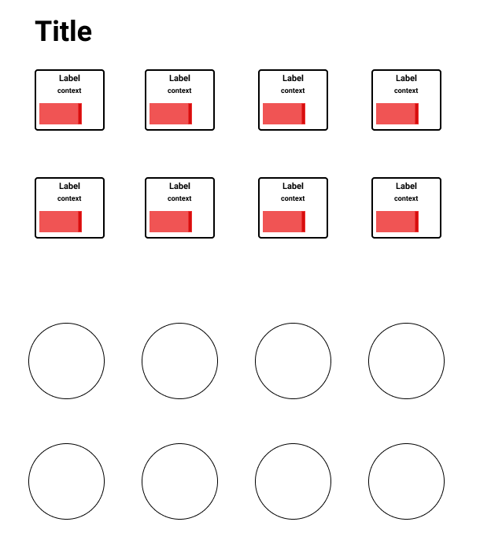

# Tiles API

## Introduction

The Tiles API Client (nodejs) is a minimalistic nodejs client to speak to the MakeProAudio Tiles Hub. Using this client API, you can speak to **Tile Chains** connected to a **Tiles Hub** running on a local or remote computer. Click [here](here) for more information on Tiles Hub. Currently you can only speak to a single Tile Chain. Multiplicity of Tile Chains will be supported later.

## Identifying COM Port On Your OS

To identify the COM Port on which your Tiles are connected, you'd run:

```
//Windows
mode (typically returns something similar to COM3)

//Mac OS
ls -lrt /dev/tty* (typically returns something similar to /dev/tty.usbmodem14101)

//Linux (tested on Raspberry Pi 3+)
ls -lrt /dev/tty* (typically returns something similar to /dev/ttyACM0)
```

## Running The Hub

Find out the `COM` port you've connected your Tile Chain to. Using the appropriate start script relevant to your OS, run the following command. For example, if on Windows, the relevant COM port is COM23 and on Mac, the relevant COM port is /dev/tty.usbmodem1411201, you'd run:

```
//Windows
start.bat COM23

//Mac OS
sh start /dev/tty.usbmodem1411201

//Linux (tested on Raspberry Pi 3+)
sh start /dev/tty.usbmodem1411201
```

> You'll need a JRE version (>=1.8) in order to run the Tiles Hub.

## Installing The Package

In order to install the package, in your nodejs environment run:

`npm i @makeproaudio/makehaus-js`

> You'll need a node version (>=6.0) in order to run the Tiles API Client.

## Connection To The Hub

Ensure that the Tiles Hub is running before you start using the client. Once you know the `host` and `port` of the Tiles Hub, use the following command to establish a connection:

```javascript
const { hub } = require('@makeproaudio/makehaus-js');
hub.init('localhost', 8192);
```

## Tile

`hub` is an `EventEmitter`. You can register to `Tiles` being found on the Hub. For example, if you're looking to work with a 12 Button Tile

```javascript
const { hub, Tile } = require('@makeproaudio/makehaus-js');
hub.on(Tile.LEDBUTTON12, tile => {
   console.log('A new Led Button 12 tile was found. There may be more tiles on the chain!')
}
```

The `Tile` enum defines the type of Tiles currently supported by the Client:

1. ENCODER8 (`TileEncoder8`)
2. ENCODER12 (`TileEncoder12`)
3. LEDBUTTON8 (`TileLedButton8`)
4. LEDBUTTON12 (`TileLedButton12`)
5. FADER4 (`TileFader4`)

## Widget

A Tile has a _widgets_ array. Each Widget has a _widgetId_ property. Continuing from the previous example, the following gives a demonstration of accessing Widgets from a Tile, and the _id_ from the _widget_:

```javascript
const widget = tile.widgets[0].widgetId;
```

`widget` is an `EventEmitter`. Depending on the type of `tile`, you can register to `Widget` events. For example, if you want to listen to Button _Pressed_ and _Released_ events:

```javascript
const { hub, Tile, LedButtonEvents } = require('@makeproaudio/makehaus-js');
hub.on(Tile.LEDBUTTON12, tile => {
  tile.widgets.forEach(w => {
    w.on(LedButtonEvents.PRESSED, button => {
      console.log(`${button.widgetId} pressed`);
    });

    w.on(LedButtonEvents.RELEASED, button => {
      console.log(`${button.widgetId} released`);
    });
  });
});
```

All Widget Events come with a `widget` argument.
Additionally, here is a list of Events by Widget type:

| Widget      | Enum               |                                  Events                                  |                                     Comments                                     |
| ----------- | ------------------ | :----------------------------------------------------------------------: | :------------------------------------------------------------------------------: |
| **Button**  | `LedButtonEvents`  |                         `PRESSED` \| `RELEASED`                          |                                                                                  |
| **Encoder** | `EncoderEvents`    | `PRESSED` \| `RELEASED` \| `TOUCHED` \| `UNTOUCHED` \| `LEFT` \| `RIGHT` | `LEFT` and `RIGHT` have an additional event argument: `acceleratedValue: number` |
| **Fader**   | `MotorFaderEvents` |                  `TOUCHED` \| `UNTOUCHED` \| `UPDATED`                   |

Some Widgets have extra functions. Here is a list of these functions by Widget type:

| Widget     | Functions                                                                                                                                                                                                                                                                          | Comments                                                                                                              |
| ---------- | ---------------------------------------------------------------------------------------------------------------------------------------------------------------------------------------------------------------------------------------------------------------------------------- | --------------------------------------------------------------------------------------------------------------------- |
| **Button** | `setColor(colorInHex: string)` <br> `setHsl(hue: number, saturation: number, lightness: number)` <br> `startFlash(destinationColorInHex: string, repCount: number, periodBefore: number, periodDestination: number, periodAfter: number, periodSource: number)` <br> `stopFlash()` |
| **Fader**  | `setValue(value: number)` <br> `getValue(): number` <br> `getRangedValue(): number`                                                                                                                                                                                                | while `setValue` and `getValue` are ranged between 0 and 65536, getRangedValue gives you the value ranged from 0 to 1 |

## Diagnostics

A simple `Diagnostics` module has been added to get you started out of the box. If started, each Event from each Widget for each Tile will be logged to the console.

```javascript
const { hub, diagnostics } = require('@makeproaudio/makehaus-js');
const ENABLEDIAGNOSTICS = true;

hub.init('localhost', 8192);
if (ENABLEDIAGNOSTICS) diag.start(hub);
```

> You should not leave the `Diagnostics` module started for your own applications.

## A Simple Animation

You can do pretty cool things with Tiles! Depending on what is present on your Chain, if started, the `AutoAnimate` module will animate an Encoder Tile, a Fader Tile and a Button Tile in the following manner:

1. Pressing and Releasing any Encoder will cycle colours on the LED Buttons
2. Turning Encoders right and left will move Motor Faders up and down

```javascript
const { hub, autoAnimate } = require('@makeproaudio/makehaus-js');
const AUTOANIMATE = true;

hub.init('localhost', 8192);
if (AUTOANIMATE) autoAnimate.start(hub);
```

> For a full example, refer to `autoanimate.ts` in the src folder.

## Running The Examples

There are several examples bundled with the repository. Clone this repository and take a look at the following in the `scripts` section of `package.json`:

1. diagnostics
2. autoanimate
3. encoderevents
4. buttonevents
5. buttonapi
6. motorfaderevents
7. motorfaderapi

To run any example, execute `npm run <name of example from the list above>`

> Depending on the tiles connected to your hub, examples may produce varying results.

# MakeHaus And Stack API

MakeHaus and the Stack API allow you to augment your tiles via your mobile devices. The API is designed to abstract widgets - both software and hardware - simply by minimal configuration. For more advanced makers, a full API is available to develop your layouts and control your widgets the way you like.



## Introduction

The library has 4 important logical components - `Widgets`, `Parameters`, `Stacks` and `Rows`.

## Widget

A `Widget` is a UI element. A Widget maybe a hardware `Widget` or a software `Widget`. The following types of Widgets exist in MakeHaus:

1. Selector - `SELECTOR_VERTICAL`, `SELECTOR_HORIZONTAL`
2. Slider - `SLIDER_VERTICAL`, `SLIDER_HORIZONTAL`
3. Toggle - `TOGGLE`
4. Button - `BUTTON`
5. Empty = `EMPTY`
6. LedButton - `LEDBUTTON`
7. Encoder - `ENCODER`
8. MotorFader - `MOTORFADER`

Widgets 1 to 5 are software `Widgets`, whereas widgets 6 to 8 are hardware `Widgets`.

> Each Widget type supports a set of properties:

| Widget     | Properties                                          |
| ---------- | --------------------------------------------------- |
| Selector   | `LABEL` \| `CONTEXT` \| `COLOR` \| `ABSOLUTE VALUE` |
| Slider     | `LABEL` \| `CONTEXT` \| `COLOR` \| `ABSOLUTE VALUE` |
| Toggle     | `LABEL` \| `CONTEXT` \| `COLOR` \| `ABSOLUTE VALUE` |
| Button     | `LABEL` \| `COLOR` \|                               |
| LedButton  | `LABEL` \| `COLOR` \|                               |
| Encoder    |                                                     |
| MotorFader | `ABSOLUTE VALUE`                                    |

> Additionally, hardware `Widgets` can be tuned into for events.

| Hardware Widget | Events            |
| --------------- | ----------------- |
| **LedButton**   | `PRESS`           |
| **Encoder**     | `TURN` \| `PRESS` |
| **MotorFader**  | `MOVE`            |

`Widgets` have additional properties, namely:

| Property       | Comments                                                                         |
| -------------- | -------------------------------------------------------------------------------- |
| **Name**       | `string` which identifies the `Widget`                                           |
| **Type**       | `string` which specifies the type of the Widget. Valid only for software Widgets |
| **Tilechain**  | refer section below for more details                                             |
| **Identifier** | refer section below for more details                                             |
| **Event**      | refer section below for more details                                             |

---

### Referencing A Hardware Widget In JSON

Each hardware `Widget` in your tilechain has a unique semantic identifier which looks like this:

> <`BoardType`>.<`BoardInstance`>.<`Row`>.<`Widget`>
>
> BoardType can be 8E, 12E, 8B, 12B or 4F

For example, if your tilechain has a single 8 Encoder Tile, the 3rd widget on the 2nd row of the Tile would have the identifier `8E.1.2.3`

Referencing a hardware `Widget` is a simple two step process.

1. Defining where MakeHaus should listen to for your Tilechain:

```json
"tilechains": [
  {
    "name": "tilechain-1",
    "address": "localhost",
    "port": 8192
  }
]
```

2. Creating a hardware `Widget` reference:

```json
{
  "name": "tcwidget-1",
  "tilechain": "tilechain-1",
  "identifier": "8E.1.1.2",
  "event": "PRESS"
},
```

## Parameter

## Stack

A `Stack` is a collection of `Widgets` with additional properties. The main purpose of a `Stack` is to abstract properties of different types of `Widgets` and present them to the user.

`Stacks` have additional properties, namely:

| Property         | Comments                                                                                         |
| ---------------- | ------------------------------------------------------------------------------------------------ |
| **Name**         | `string` which identifies the `Stack`                                                            |
| **Context**      | `string`                                                                                         |
| **Label**        | `string`                                                                                         |
| **Color**        | `string`                                                                                         |
| **Min,Max,Step** | `number` either these properties or **Values** can be specified                                  |
| **Values**       | `string[]` \| `number[]` \| `boolean[]`either this property or **Min,Max,Step** can be specified |
| **Widgets**      | `Widget[]`                                                                                       |

Consider the following trivial example:

Let's say you want to show a `Slider` on screen for an `Encoder` you have in your hardware `Tile` with `Min` set to `0`, `Max` set to `100` and `Step` set to `5`. You'd like the `Value` of the `Slider` to increase or decrease depending on when the `Encoder` is `TURNED`. Let's assume this `Encoder` stands for the brightness of your lamp.

While you could implement all of this programatically, the platform allows you to define this in simple json configuration, in the following manner:

```json
{
  "name": "stack-1",
  "context": "Lamp",
  "label": "Brightness",
  "min": 0,
  "max": 100,
  "step": 5,
  "defaultValue": 0,
  "color": "1F1F1F",
  "widgets": [
    {
      "name": "widget-1",
      "type": "SLIDER_HORIZONTAL"
    },
    {
      "name": "tcwidget-1",
      "tilechain": "tilechain-1",
      "identifier": "8E.1.1.1",
      "event": "TURN"
    }
  ]
}
```

Instead, if you wanted the `Value` to be updated when the `Encoder` was `PRESSED`, simply update the event for that `Widget` to `PRESS` in the following manner:

```json
{
  "name": "tcwidget-1",
  "tilechain": "tilechain-1",
  "identifier": "8E.1.1.1",
  "event": "PRESS"
}
```

Now in code, to bind to `Value` changes of this `Stack`, create a `Parameter` and bind to it in the following manner:

```javascript
const { Stacks } = require('@makeproaudio/makehaus-js');
const { Parameters } = require('@makeproaudio/parameters');
const stack = Stacks.get('stack-1');
const param = Parameters.newParameter('maker', stack.name());
param.bindTo(stack, evt => {
  console.log(evt.value);
  // Update your MIDI value, your lamp's brightness or any other use case you can think of :)
});
```

## Row

A `Row` is a logical horizontal arrangement of Widgets.
MakeHaus doesn't differentiate between `Rows` of `Widgets` in a hardware `Tile` or Rows of `Widgets` on a software UI.

`Rows` have additional properties, namely:

| Property         | Comments                                                                             |
| ---------------- | ------------------------------------------------------------------------------------ |
| **Name**         | `string` which identifies the `Row`                                                  |
| **Weight**       | `number` which specifies the proportion of the row's height compared to other `Rows` |
| **WidgetStacks** | `Stack[]`                                                                            |

A typical `Row` defined in JSON would look like this:

```json
"rows": [
        {
            "name": "row-1",
            "weight": 1,
            "widgetstacks": [
                {
                    "name": "stack-1",
                    "weight": 1,
                    "context": "",
                    "label": "",
                    "color": "blue",
                    "widgets": [
                        {
                            "name": "widget-1",
                            "type": "BUTTON"
                        }
                    ]
                },
                {
                    "name": "stack-2",
                    "context": "",
                    "label": "",
                    "color": "blue",
                    "widgets": [
                        {
                            "name": "widget-2",
                            "type": "BUTTON"
                        }
                    ]
                }
            ]
        }
```

# MakeHaus Initialization

To start off your own application, utilize the MakeHaus init function in the following manner:

```javascript
MakeHaus.init(
  /* layout json is a string */
  layoutJson,
  () => {
    /* Web app initialization was successful. */
  },
  () => {
    /* TileChain initialization was successful */
  }
);
```

## Running The Examples

There are several examples bundled with the repository. Clone this repository and take a look at the following in the `scripts` section of `package.json`:

1. makehaus-simple-butled8
2. makehaus-simple-butled12
3. makehaus-simple-encoder8-turn
4. makehaus-simple-encoder12-press
5. makehaus-simple-motordader4
6. makehaus-full-phone
7. makehaus-full-tablet

To run any example, execute `npm run <name of example from the list above>`

> Depending on the tiles connected to your hub, examples may produce varying results.
